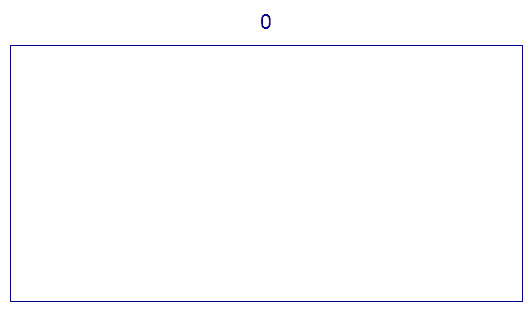
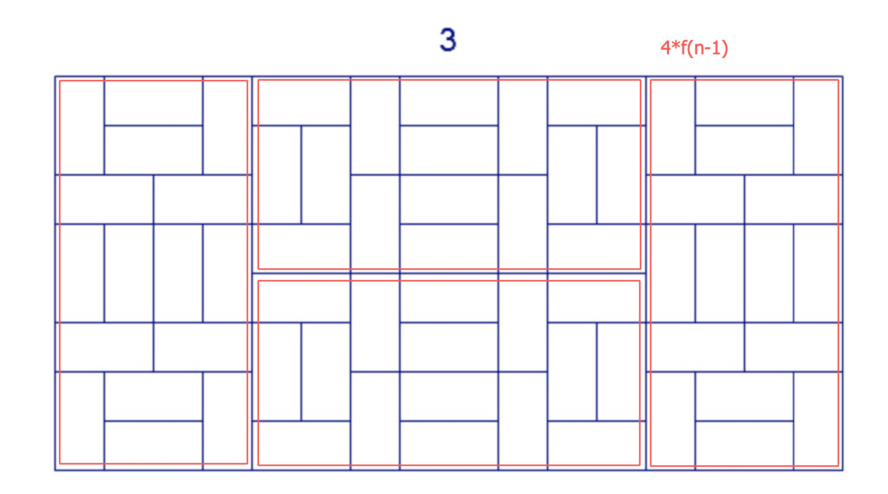
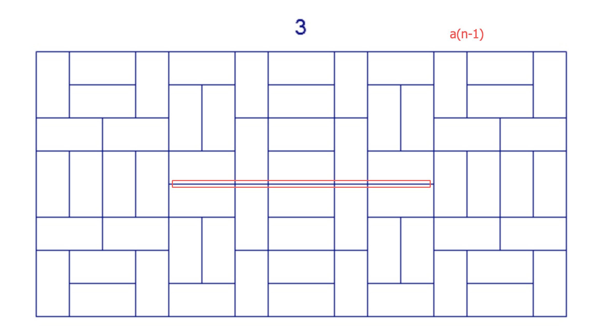
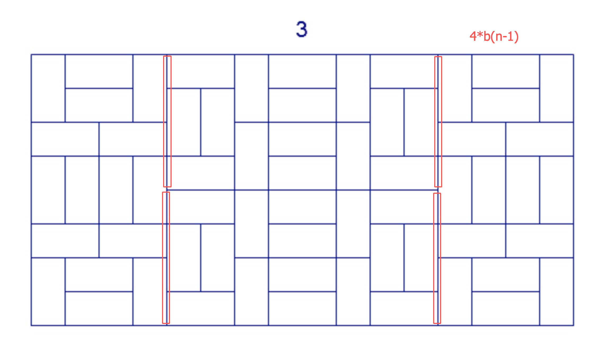
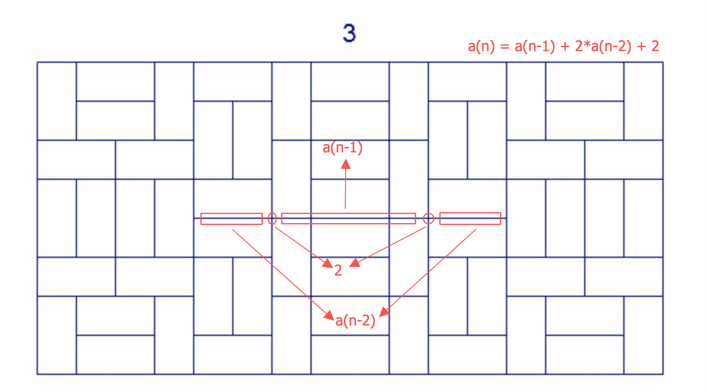
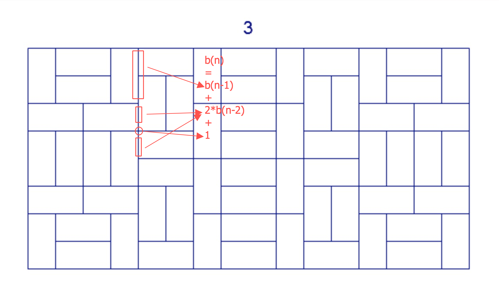
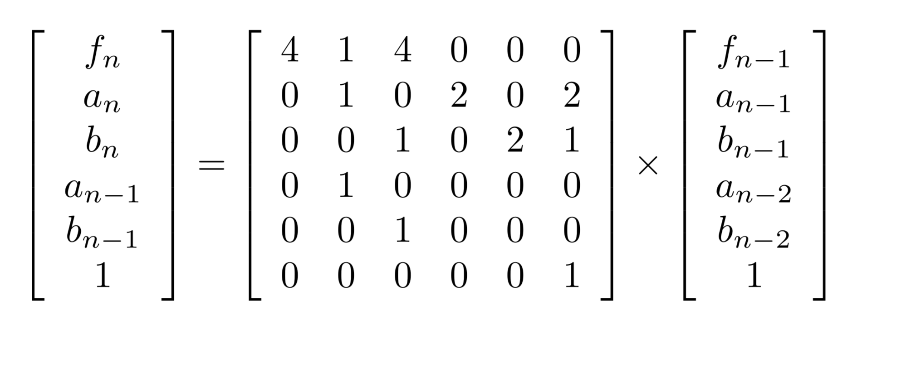

[开启传送门](https://projecteuler.net/problem=405)

### 题目描述
<!-- more -->

We wish to tile a rectangle whose length is twice its width.
Let $T(0)$ be the tiling consisting of a single rectangle.
For $n > 0$, let $T(n)$ be obtained from $T(n-1)$ by replacing all tiles in the following manner:


The following animation demonstrates the tilings $T(n)$ for $n$ from $0$ to $5$:



Let $f(n)$ be the number of points where four tiles meet in $T(n)$.
For example, $f(1) = 0$, $f(4) = 82$ and $f(10^9)$ mod $17^7 = 126897180$.

Find $f(10^k)$ for $k = 10^{18}$, give your answer modulo $17^7$.

## 题意

就和上面的动图一样，让你数出当 $n = 10^{10^{18}}$ 的时候，有多少个四岔点。

## 分析

吐槽一句，这个题的数据范围有点大也有点小。因为大，所以第一时间就想到了欧拉降幂，这样数据范围就很小了。所以这题才40%难度。

比较容易想到的就是答案分为三部分。

- 一拆为四，那么显然有一部分答案为 $4*f(n-1)$.
- 然后就考虑四块之间的部分，首先是两个躺着的，不妨设答案为 $a(n)$
- 最后就是左边，右边和中间的交叉点，不妨设答案为 $b(n)$

所以答案就可以表示为 $f(n) = 4*f(n-1) + a(n-1) + 4*b(n-1) $  。 如下图所示（以$n=3$为例）：







剩下的问题就是考虑怎么计算 $a(n)$ 和 $b(n)$ 。还是以上面的例子为例。我们有





所以我们有：

- $f(n) = 4*f(n-1) + a(n-1) + 4*b(n-1)$
- $a(n) = a(n-1) + 2*a(n-2) + 2$
- $b(n) = b(n-1) + 2*b(n-2) + 1$

其中边界条件是

- $a(1) = 0,\ \ a(2) = 2$
- $b(1) = 0,\ \ b(2) = 1$

于是可以转成快速幂的方式，如下：



至于题目中的数据范围，显然是需要欧拉降幂来搞。

## 代码

给大佬递上我奇丑无比的代码　(*/ω＼*)

```cpp

```

